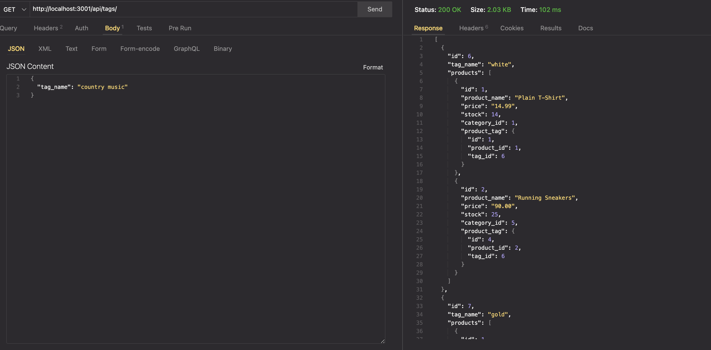

# 1. ORM-E-Commerce-back-end

## Object-Relational Mapping (ORM): E-Commerce Back End

# 2. Description

### E-commerce is an important part of our lives as it significantly impacts our economy and the way we purchase goods from onlie retail giants like Amazon.

# 3. User Story

```md
GIVEN a functional Express.js API
WHEN I add my database name, PostgreSQL username, and PostgreSQL password to an environment variable file
THEN I am able to connect to a database using Sequelize
WHEN I enter schema and seed commands
THEN a development database is created and is seeded with test data
WHEN I enter the command to invoke the application
THEN my server is started and the Sequelize models are synced to the PostgreSQL database
WHEN I open API GET routes in Insomnia for categories, products, or tags
THEN the data for each of these routes is displayed in a formatted JSON
WHEN I test API POST, PUT, and DELETE routes in Insomnia
THEN I am able to successfully create, update, and delete data in my database
```

# 4. How to use

### With this command-line application you''ll run command ```npm run start``` and then you can use either Insomia or an extension like Thunder Client to test the api routes. 

# 5. Deployment

## https://github.com/jesse437/ORM-E-Commerce-back-end

# 6. Visuals

## 

#### <video controls src="./demoORM.mp4" title="Title"></video>

# 7. Collaborators

## [Jesus Ruiz Gutierrez](https://github.com/jesse437)

# 8. Technologies Used

- (ORM) Object-Relational-Mapping
- Express.js
- PostgresSQL
- pg package
- Sequelize package
- dotenv package
